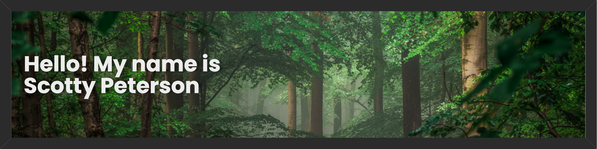

I'm a developer who is passionate about building web applications.

## 🚀 Projects

- 🎵 **GenreScope** - a web application that utilizes the Spotify, and Youtube APIs to help users discover new music.
- 🎮 **MyClip** - a clip uploading app where you can upload your gifyourgame.com clips. Each clip has a comment section, star rating, and an average of the number of stars rated by users.
- ⌨️ **HyperTyper** - a simple speed typing app made collaboratively during my time at Flatiron School.

## 💻 Skills

- Languages: JavaScript, Python, Ruby, HTML/CSS
- Front-end: React, Bootstrap
- Back-end: Django, Rails
- Content Management Systems (CMS): WordPress, Wix
- Databases: PostgreSQL
- Tools: Git, VS Code, Postman, Jira, Figma

## 🌱 Currently Learning

- TypeScript
- AWS
- Redux/Redux Toolkit

## 📫 Let's Connect

[LinkedIn](https://www.linkedin.com/in/scotty-peterson/)

