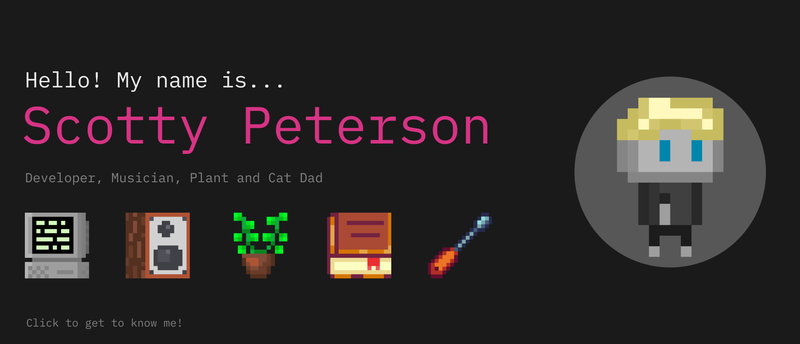

## 🚀 Projects

<!-- <table style="width: 100%;">
  <tr>
    <td style="text-align: center; width: 25%;">
      
         <strong>Woolie.tv</strong> 
        Relaxation platform where you can customize your own experience. Choose between sets of videos, music, and background audio to fine-tune your journey.
    </td>
    <td style="text-align: center; width: 25%;">
      
         <strong>GenreScope</strong> 
        Web application that utilizes the Spotify and Youtube APIs to help users discover new music via genre.
    </td>
    <td style="text-align: center; width: 25%;">
      
         <strong>MyClip</strong> 
        Clip uploading app where you can upload your gifyourgame.com clips. Each clip has a comment section, star rating, and an average of the number of stars rated by users.
    </td>
    <td style="text-align: center; width: 25%;">
      
         <strong>HyperTyper</strong> 
        Simple speed typing app made collaboratively during my time at Flatiron School.
    </td>
  </tr>
</table> -->

**Woolie.tv**:
Relaxation platform where you can customize your own experience. Choose between sets of videos, music, and background audio to fine-tune your journey.

---
<!-- Horizontal line to separate -->

**GenreScope**:
Web application that utilizes the Spotify and Youtube APIs to help users discover new music via genre.

---
<!-- Horizontal line to separate -->

**MyClip**:
Clip uploading app where you can upload your gifyourgame.com clips. Each clip has a comment section, star rating, and an average of the number of stars rated by users.

---
<!-- Horizontal line to separate -->

**HyperTyper**:
Simple speed typing app made collaboratively during my time at Flatiron School. Try to beat your best time!

## 💻 Skills

- Languages: JavaScript, Python, Ruby, HTML/CSS
- Front-end: React, Bootstrap
- Back-end: Django, Rails
- Content Management Systems (CMS): WordPress, Wix
- Databases: PostgreSQL
- Tools: Git, VS Code, Postman, Jira, Figma

## 🌱 Currently Learning

- TypeScript
- AWS
- Redux/Redux Toolkit

## 📫 Let's Connect

[LinkedIn](https://www.linkedin.com/in/scotty-peterson/)

[Instagram](https://www.instagram.com/scottsdaaale)

