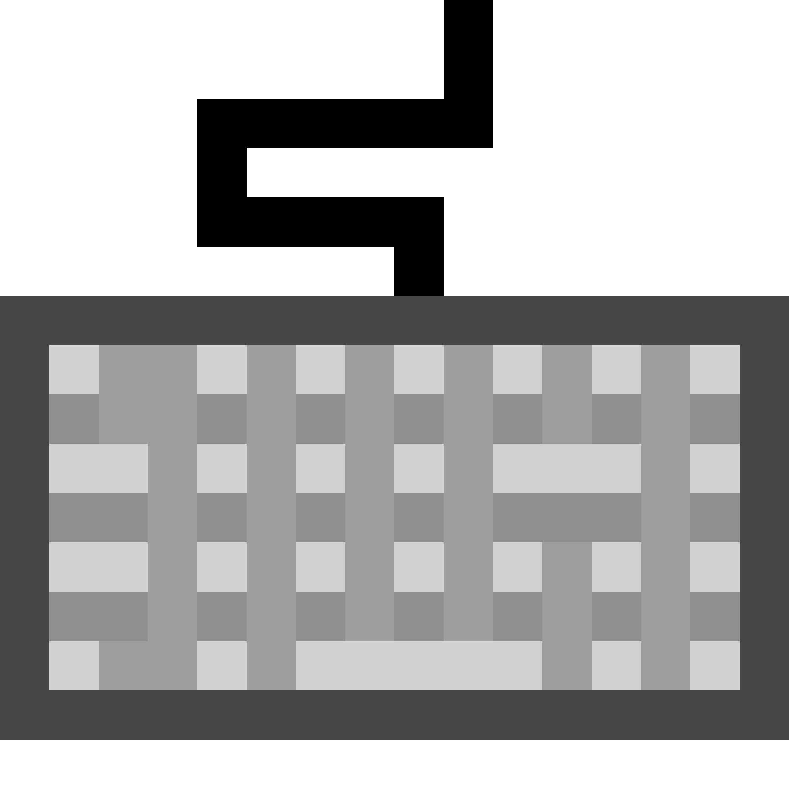

{:target="_blank"}

## 🚀 Projects

<table>
  <tr>
    <td style="text-align: center;">
      
         <strong>GenreScope</strong> 
        Web application that utilizes the Spotify and Youtube APIs to help users discover new music via genre.
    </td>
    <td style="text-align: center;">
      
         <strong>MyClip</strong> 
        Clip uploading app where you can upload your gifyourgame.com clips.
        Each clip has a comment section, star rating, and an average of the number
        of stars rated by users.
    </td>
    <td style="text-align: center;">
      
         <strong>HyperTyper</strong> 
        Simple speed typing app made collaboratively during my time at Flatiron School.
    </td>
  </tr>
</table>

## 💻 Skills

- Languages: JavaScript, Python, Ruby, HTML/CSS
- Front-end: React, Bootstrap
- Back-end: Django, Rails
- Content Management Systems (CMS): WordPress, Wix
- Databases: PostgreSQL
- Tools: Git, VS Code, Postman, Jira, Figma

## 🌱 Currently Learning

- TypeScript
- AWS
- Redux/Redux Toolkit

## 📫 Let's Connect

[LinkedIn](https://www.linkedin.com/in/scotty-peterson/)

